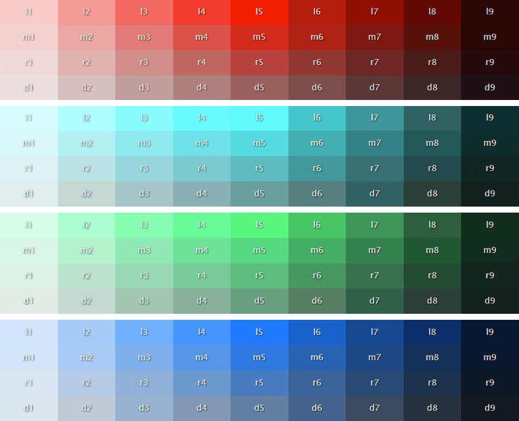
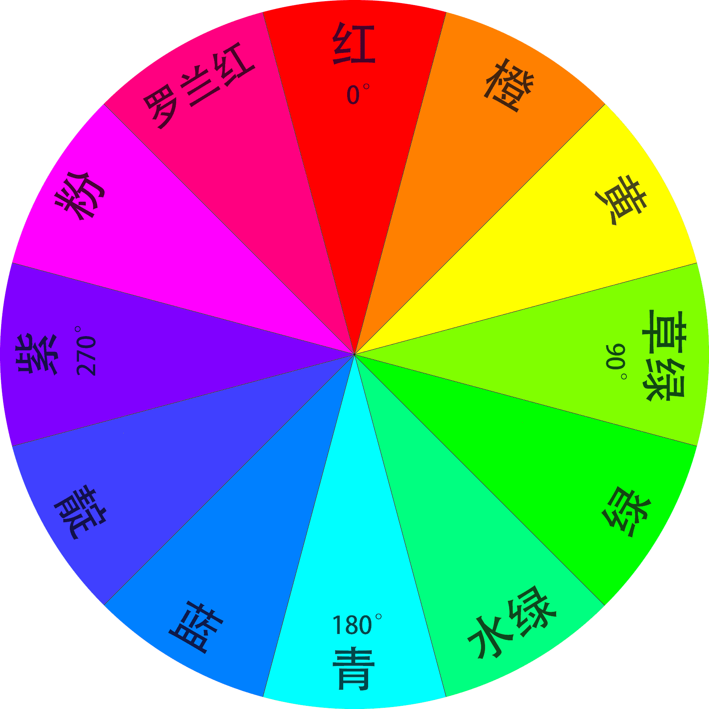
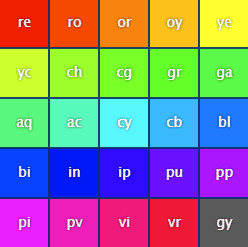
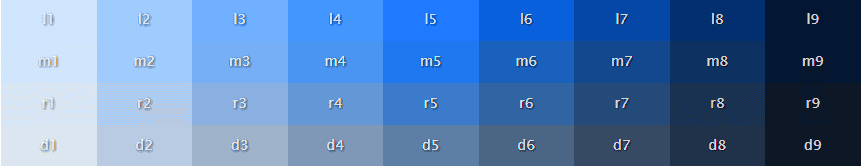
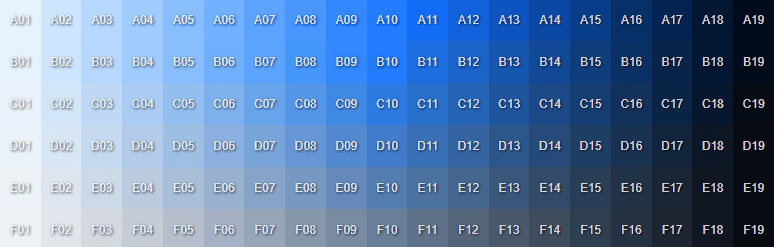
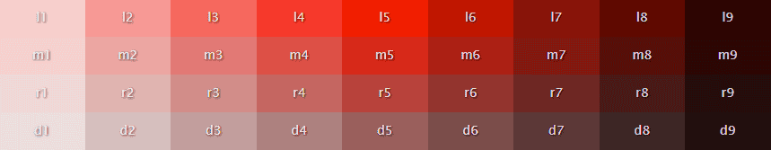
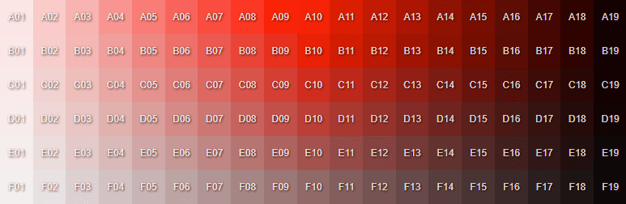
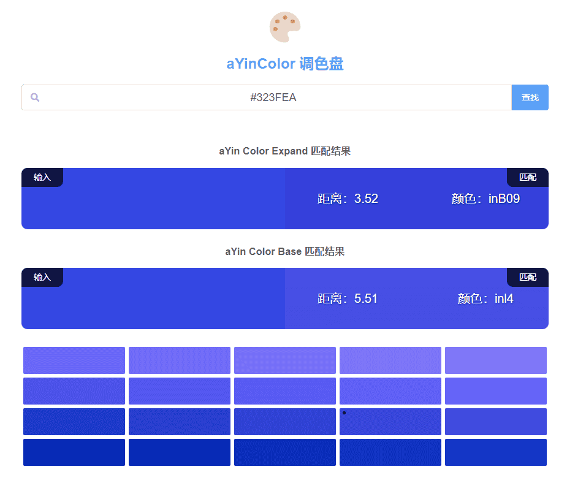

English | [简体中文](./README.md)

Translated by google


<p align="center">
   <a href="http://124.222.103.91/">Digital Cube Demo Station</a> •
   <a href="http://124.222.103.91:8080/">Digital Cube Documentation</a> •
   <a href="https://www.npmjs.com/package/ayin-color">AyinColor Npm</a> •
   <a href="https://space.bilibili.com/302402751">Bili Video Blog</a>
</p>

<h1 align="center">
<b>AyinColor</b>
</h1>
<div align="center">AyinColor is a color library tool, in order to avoid memorizing color values like #FF000, RGB(255,0,0), and conveniently call various preset colors during development, So this tool was developed. </div>

# Directory introduction

Mainly the following three directories:
- **aYinColor-V1 source**- the source code of the first version
- **aYinColor-V2 source**- the source code of the second edition
- **npm publish package**-published to the npm packaged version

If you just use it, please read the documentation and configure it according to the [Use in Project] section. If you need a second iterative development, please download the source code of V1 and V2 to modify iteratively.


**Color chart view, please go here**

- **[V1 color table](http://124.222.103.91:8080/component/21--ayin-color#%E9%A2%9C%E8%89%B2%E8%A1%A8v1)**
- **[V2 color table](http://124.222.103.91:8080/component/21--ayin-color#%E9%A2%9C%E8%89%B2%E8%A1%A8v2)**

Gitee cannot recognize the color values in html tags, so it cannot display the color table on this page.


# Introduction



The color selection case is as follows:

- Red - `rel5`
- light red - `rel1`
- Crimson - `rel9`
- Blue - `bll5`
- Blue low saturation - `bld5`
- light blue low saturation - `bld1`

The earliest version of AyinColor was developed in October 2018, the V1 version.

AyinColor color library contains two versions:

- **JS version - developed based on chroma.js library**

- **CSS version - developed based on Less.js**

Its design idea is to generate all other color values in the color table by **changing the hue, saturation, light and dark** according to the hexadecimal color value `#FF0000` of pure red.

After the first version was developed, many versions were iterated, the essence of which was just to increase the number of changes in saturation and light and dark.

But none of them are used. The fundamental reason is that although the V1 version has fewer colors, it is easy to control and is sufficient for general project development.

Please click [here](https://www.bilibili.com/video/BV1kG411h7Px/?vd_source=4f3738cd3388bbbb606cea36d41d0899) to view the video introduction

-----

# base color

**The selection of the basic color is essentially the adjustment of the hue angle. **



**Starting from 0 degrees, every time the hue is deflected by 30 degrees, a basic color value is generated, and 12 basic color values are obtained**

- **red**-hue=0
- **orange**-hue=30
- **yellow**-hue=60
- **chartreuse**-hue=90
- **green**-hue=120
- **aquamarine**-hue=150
- **cyan**-hue=180
- **blue**-hue=210
- **Indigo**-hue=240
- **purple**-hue=270
- **pink**-hue=300
- **violetred**-hue=330

If it is offset by 30 degrees again, 330+30=360 degrees, it actually returns to the position of 0 degrees


These 12 basic color values have too much difference in hue, so the hue deflection is changed to 15 degrees, which is equivalent to interspersing an intermediate value in the middle of each basic color value above, and 24 basic color values are obtained.
24 basic colors, plus an additional gray, a total of **25 basic colors** were born.

As shown below:




**Chinese and English names and abbreviations of 25 basic colors:**

- **red** `re`
   - red-orange `ro`
- **orange** `or`
   - orange-yellow `oy`

- **yellow** `ye`
   - yellow-chartreuse `yc`
- **chartreuse ** `ch`
   - chartreuse-green `cg`
- **green** `gr`
   - green-aquamarine `ga`
- **aquamarine**- `aq`
   - aquamarine-cyan `ac`
- **cyan** `cy`
   - cyan-blue `cb`
- **blue** `bl`
   - blue-indigo `bi`
- **indigo** `in`
   - indigo-purple `ip`
- **purple** `pu`
   - purple-pink `pp`
- **pink** `pi`
   - pink-violetred `pv`
- **violetred** `vi`
   - violetred-red `vr`
- **gray** `gy`


At that time, when naming the 12 basic colors in Chinese and English, it was determined after consulting a lot of information and literature, but even now I am not sure whether the naming is accurate, so let's use it like this.

-----


# Saturation change

The saturation of V1 is divided into 4 types

- light `l`
- middle `m`
- rost `r`
- dark `d`

The earliest AyinColor has three saturation levels, light, middle, and dark, but I feel that the color changes in saturation too little, so I introduced a rost (roasted, baked, burnt), and the V1 version is officially stereotyped.

As shown in the figure below, the change in the **vertical axis direction** is the change in saturation



The saturation changes of **V2 version** are divided into six types: **A, B, C, D, E, and F**. Because I can’t find a suitable word to express these 6 kinds of saturation changes, I use uppercase The letters A-F are directly substituted.

As shown in the figure below, the change in the **vertical axis direction** is the change in saturation



-----

# change of light and dark

**V1's light and dark changes are divided into 9 types, replaced by numbers 1-9**

As shown in the figure below, the change in the **horizontal axis** is the change in light and shade



**There are 19 types of light and dark changes in V2, replaced by numbers 01-19**

As shown in the figure below, the change in the **horizontal axis** is the change in light and shade



There are also other different versions developed in the middle. For example, the saturation change code-named AyinColorFull is divided into 10 types, and the light and dark are divided into 19 types. Each basic color change has 190 color values. The difference between adjacent colors is very large. Small, when picking colors in my mind, because there are too many levels of saturation and light and shade, it is like a ball of paste, and it is useless in the end.

The development of V2 was because when developing the data visualization framework later, when doing color matching work, I felt that the saturation and light and shade changes of V1 were too little, and a more delicate color table was needed, so it was only around March 2022, based on The previously developed AyinColorFull was renamed to V2 after transformation and integrated into the framework.

The V2 version is based on the reduction of saturation from 10 to 6 by AyinColorFull.

At present, in the process of developing projects, the author uses the V1 version the most, because it has fewer changes and is easy to grasp, and its color changes are more than enough for general project development. Only when the development of a large-screen visualization framework encounters some more detailed colors, the V2 color matching table will be called.

-----

# Used in JS code

The JS versions of AyinColorV1 and V2 have been integrated in this framework and can be used directly.

Use case code:

```js
//AyinColor V1
let color=$c.rel5
//AyinColor V2
let color=$c.reA10
```

-----

# used in CSS code

**Because the color table of CSS is developed based on Less, the less component needs to be installed. **

The Less version of AyinColorV1 and V2 has been integrated in this framework and can be used directly.

Use case code:
```less
//AyinColor V1
.text{color:@rel5; background-color:@bll5; border:1px solid @gyd4;}

//AyinColor V2
.text{color:@reA10; background-color:@blA03; border:1px solid @gyE05;}
```

In the future, a set of native CSS color components may be developed, such as mounting the color value to the `:root` of CSS and calling it by `var(--color-rel5)`. Dig a hole and wait for time to develop.

-----


# Advanced processing of color values

If you need to change bll5 to 0.5 transparency

JavaScript code

```js
let color=$c. fade('bll5',.5)
```

Less code

```less
.text{color:fade(@bll5,50%);}
```


**The following advanced processing functions are provided in JS:**

- **fade**-transparency
- **hslh**-hue
- **hsls**-saturation
- **hsll**-light and dark
- **darken**- darken
- **lighten**-lighten
   - The above processing functions are used `$c.xxxx(color,num)`, refer to the JS code example above.
   - The above functions are encapsulated by the color processing functions in chroma.js.
   - The input of the num value is slightly different. For example, the transparency is a floating point number, and the hue is a degree. For specific usage and parameter passing, please refer to the relevant chapters in chroma.js.
- **scale** - Calculate the interval value between multiple colors
   - The use of scale is `$c.scale([color1,color2,.....colorN],num,type)`
   - At least 2 color arrays are passed in, no upper limit
   - num is the number of colors that need to be obtained
   - type is the processing method, not required, the default value is `lch`, the alternative values are `lch`, `hsl`, `lab`, `lrgb`


**Less provides the following processing functions:**

- **fade** transparent
- **fadein** increases transparency
- **fadeout** reduces transparency
- **lighten** lightness
- **darken** darkens
- **spin** Hue
- **saturate** Saturation+
- **desaturate** Saturation-
- **tint** mixed with white to reduce color scale
- **shade** mixed with black to reduce color scale
- **greyscale** loss of saturation
- **contrast** Contrast
- **mix** mixes two colors

Commonly used are nothing more than fade, lighten, darken, etc. For other usage methods and detailed introductions, please refer to the color operation section in the LESS document


-----


# used in the project

**The JS and CSS versions of AyinColorV1 and V2 are open source**, and can be used in any project at will (the declaration information in the package needs to be preserved).

**npm address is as follows [AyinColor](https://www.npmjs.com/package/ayin-color?activeTab=readme)**


Its internal file list is as follows:

- ayin-color.less (V1 for CSS version)
- ayin-color-expand.less (V2 for CSS version)
- ayin-color.js (for JS version)
- ayin-color.json (the corresponding static color value of the JS version)
- index.js (entry file)

How to use the JS version:

```js
//npm installation, recommend cnpm or pnpm
npm i ayin-color --save

//Introduce in main.js
import {AyinColor} from "ayin-color"
Vue. use(AyinColor)
```


How to use the CSS version:

```js
//vue2 is configured in vue.config.js
//Need to install less, less-loader, style-resources-loader before configuration
pluginOptions: {
     'style-resources-loader': {
         preProcessor: 'less',
             patterns: [
                 path.resolve(__dirname, "./node_modules/ayin-color/ayin-color.less"),
                 path.resolve(__dirname, "./node_modules/ayin-color/ayin-color-expand.less")
             ]
     }
},
    
//Used in vue3+vite Configure in vite.config.js
//Need to install less and less-loader before configuration
css: {
     preprocessorOptions: {
         less: {
             javascriptEnabled: true,
             additionalData:`
           @import "${path.resolve(__dirname, './node_modules/ayin-color/ayincolor.less')}";
           @import "${path.resolve(__dirname, './node_modules/ayin-color/ayincolor-expand.less')}";
          `
         }
     }
},
```

-----

# color conversion tool

In the process of using AyinColor for development, it is often necessary to convert ordinary hexadecimal colors or RGBA colors into colors in AyinColor, so a color conversion tool has been developed.




This tool can input any color value, such as red, #FF0000, rgb(5,245,230)

Returns the matching results of the two versions of AyinColor. The smaller the **distance** parameter in the returned result, the closer it is to the original color.

**This tool is located in the aYinColor-V2 source directory. **